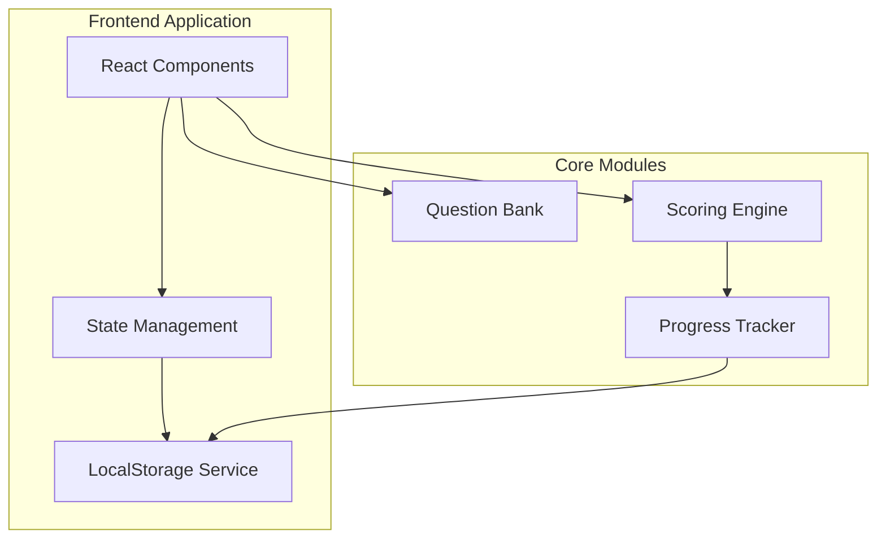
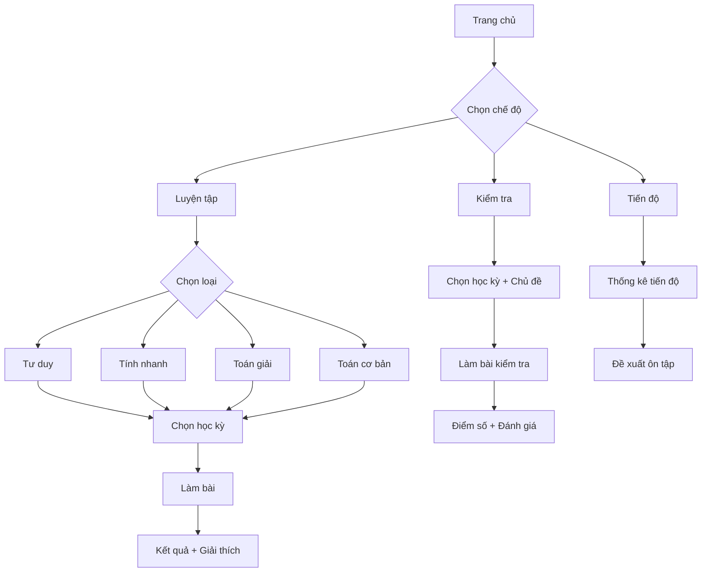

# Design Document: Website Ôn tập Toán Lớp 5

## Overview

Website ôn tập Toán lớp 5 là một ứng dụng web single-page application (SPA) được xây dựng với React và TypeScript. Hệ thống sử dụng kiến trúc client-side với local storage để lưu trữ tiến độ học tập, đảm bảo hoạt động offline và dễ dàng triển khai trên Railway.

### Công nghệ sử dụng
- **Frontend**: React 18 + TypeScript + Vite
- **Styling**: Tailwind CSS (giao diện tối giản, hiện đại)
- **State Management**: React Context + useReducer
- **Storage**: LocalStorage (lưu tiến độ, điểm số)
- **Deployment**: Railway / Local

## Architecture



### Cấu trúc thư mục

```
src/
├── components/          # React components
│   ├── common/          # Shared components (Button, Card, Timer)
│   ├── layout/          # Layout components (Header, Navigation)
│   ├── modes/           # Practice mode components
│   └── test/            # Test mode components
├── data/                # Question bank data
│   ├── semester1/       # Học kỳ 1 questions
│   └── semester2/       # Học kỳ 2 questions
├── hooks/               # Custom React hooks
├── services/            # Business logic services
├── types/               # TypeScript type definitions
├── utils/               # Utility functions
└── App.tsx              # Main application
```

## Components and Interfaces

### Core Type Definitions

```typescript
// types/question.ts
interface Question {
  id: string;
  semester: 1 | 2;
  topic: Topic;
  type: QuestionType;
  difficulty: 'easy' | 'medium' | 'hard';
  content: string;
  options?: string[];        // For multiple choice
  correctAnswer: string | number;
  explanation: string;
  hints?: string[];
}

type QuestionType = 'tu-duy' | 'tinh-nhanh' | 'toan-giai' | 'toan-co-ban';

type Topic = 
  // Semester 1
  | 'so-tu-nhien' | 'phan-so' | 'so-thap-phan-1' | 'hinh-hoc-co-ban'
  // Semester 2
  | 'so-thap-phan-2' | 'ti-so-phan-tram' | 'hinh-hoc-nang-cao' | 'on-tap-cuoi-nam';

// types/progress.ts
interface StudentProgress {
  totalExercises: number;
  correctAnswers: number;
  testScores: TestResult[];
  practiceHistory: PracticeSession[];
  weakTopics: Topic[];
  lastActive: Date;
}

interface TestResult {
  id: string;
  date: Date;
  semester: 1 | 2;
  topics: Topic[];
  score: number;          // 0-10 scale
  totalQuestions: number;
  correctAnswers: number;
  timeSpent: number;      // seconds
  answers: AnswerRecord[];
}

interface PracticeSession {
  id: string;
  date: Date;
  mode: QuestionType;
  questionsAttempted: number;
  correctAnswers: number;
  timeSpent: number;
}

interface AnswerRecord {
  questionId: string;
  studentAnswer: string | number;
  isCorrect: boolean;
  timeSpent: number;
}
```

### Component Interfaces

```typescript
// components/modes/PracticeModeProps.ts
interface PracticeModeProps {
  mode: QuestionType;
  semester: 1 | 2;
  onComplete: (session: PracticeSession) => void;
}

// components/test/TestModeProps.ts
interface TestModeProps {
  semester: 1 | 2;
  topics: Topic[];
  questionCount: number;
  timeLimit?: number;      // minutes
  onComplete: (result: TestResult) => void;
}

// components/common/QuestionCardProps.ts
interface QuestionCardProps {
  question: Question;
  showHint: boolean;
  onAnswer: (answer: string | number) => void;
  onRequestHint: () => void;
}

// components/common/TimerProps.ts
interface TimerProps {
  duration: number;        // seconds
  onTimeUp: () => void;
  isPaused: boolean;
}
```

## Data Models

### Question Bank Structure

```typescript
// data/questionBank.ts
interface QuestionBank {
  semester1: {
    'so-tu-nhien': Question[];
    'phan-so': Question[];
    'so-thap-phan-1': Question[];
    'hinh-hoc-co-ban': Question[];
  };
  semester2: {
    'so-thap-phan-2': Question[];
    'ti-so-phan-tram': Question[];
    'hinh-hoc-nang-cao': Question[];
    'on-tap-cuoi-nam': Question[];
  };
}

// Example question structure
const exampleQuestion: Question = {
  id: 'td-001',
  semester: 1,
  topic: 'so-tu-nhien',
  type: 'tu-duy',
  difficulty: 'medium',
  content: 'Tìm số tiếp theo trong dãy: 2, 6, 12, 20, 30, ?',
  options: ['40', '42', '44', '46'],
  correctAnswer: '42',
  explanation: 'Quy luật: Hiệu giữa các số liên tiếp tăng dần 4, 6, 8, 10, 12. Vậy số tiếp theo là 30 + 12 = 42',
  hints: ['Hãy tìm hiệu giữa các số liên tiếp', 'Hiệu đó có quy luật gì?']
};
```

### Scoring Engine

```typescript
// services/scoringService.ts
interface ScoringService {
  calculateScore(correct: number, total: number): number;
  calculateGrade(score: number): string;
  getRecommendations(results: TestResult[]): Topic[];
}

// Score calculation: 10-point scale
// score = (correctAnswers / totalQuestions) * 10
// Rounded to 1 decimal place
```

### Storage Service

```typescript
// services/storageService.ts
interface StorageService {
  saveProgress(progress: StudentProgress): void;
  loadProgress(): StudentProgress | null;
  saveTestResult(result: TestResult): void;
  getTestHistory(): TestResult[];
  savePracticeSession(session: PracticeSession): void;
  clearAllData(): void;
}
```

## User Interface Flow




## Correctness Properties

*A property is a characteristic or behavior that should hold true across all valid executions of a system—essentially, a formal statement about what the system should do. Properties serve as the bridge between human-readable specifications and machine-verifiable correctness guarantees.*

### Property 1: Question Structure Completeness
*For any* question in the question bank, it SHALL have all required fields: id, semester (1 or 2), topic, type, difficulty, content, correctAnswer, and explanation.
**Validates: Requirements 2.4, 6.3, 8.2**

### Property 2: Mode-Question Type Consistency
*For any* practice mode selection, all returned questions SHALL have a type matching the selected mode (tu-duy, tinh-nhanh, toan-giai, or toan-co-ban).
**Validates: Requirements 3.1**

### Property 3: Answer Feedback Completeness
*For any* question and submitted answer, the system SHALL return feedback containing: whether the answer is correct, the correct answer, and an explanation.
**Validates: Requirements 3.3, 5.4, 6.4**

### Property 4: Hint Non-Disclosure
*For any* question with hints, each hint SHALL NOT contain the exact correct answer value.
**Validates: Requirements 5.3**

### Property 5: Timed Session Results
*For any* timed practice session that ends (by time expiration or completion), the system SHALL produce a result containing: questions attempted, correct answers, and time spent.
**Validates: Requirements 4.4**

### Property 6: Test Score Calculation
*For any* completed test with N total questions and C correct answers, the calculated score SHALL equal (C / N) * 10, rounded to 1 decimal place.
**Validates: Requirements 7.3**

### Property 7: Test Content Matching
*For any* test generated with specified semester and topics, all questions in the test SHALL belong to the specified semester and at least one of the specified topics.
**Validates: Requirements 7.2**

### Property 8: Incorrect Answer Explanation
*For any* incorrect answer in a completed test, the result SHALL include the correct answer and explanation for that question.
**Validates: Requirements 7.4**

### Property 9: Test History Persistence (Round-trip)
*For any* completed test result, saving it and then loading test history SHALL return a collection containing an equivalent test result.
**Validates: Requirements 7.5**

### Property 10: Low Score Recommendations
*For any* test result with score below 5, the system SHALL generate at least one topic recommendation for review.
**Validates: Requirements 7.6**

### Property 11: Question Selection Variety
*For any* two consecutive question generations with the same parameters (mode, semester, topic), the question sets SHALL NOT be identical (given sufficient questions in the bank).
**Validates: Requirements 8.4**

### Property 12: Progress Tracking Completeness
*For any* completed practice session or test, the progress tracker SHALL record: activity type, questions attempted, correct answers, and timestamp.
**Validates: Requirements 9.1**

### Property 13: Weak Area Identification
*For any* set of test results where a topic has average score below 5, that topic SHALL appear in the weak areas list.
**Validates: Requirements 9.3, 9.4**

### Property 14: Difficulty Progression
*For any* student progress data, the suggested difficulty level SHALL be based on recent performance (higher accuracy → harder questions suggested).
**Validates: Requirements 3.4**

## Error Handling

### Input Validation
- Empty or whitespace-only answers SHALL be rejected
- Invalid question IDs SHALL return appropriate error messages
- Timer values SHALL be validated (positive integers only)

### Storage Errors
- LocalStorage unavailability SHALL trigger in-memory fallback
- Corrupted data SHALL be handled gracefully with option to reset

### Question Bank Errors
- Missing questions for a topic SHALL display appropriate message
- Invalid question format SHALL be logged and skipped

## Testing Strategy

### Unit Tests
Unit tests verify specific examples and edge cases:
- Homepage renders with navigation elements
- Semester selection shows correct topics
- Timer countdown works correctly
- Score calculation edge cases (0/10, 10/10, partial scores)
- LocalStorage save/load operations

### Property-Based Tests
Property-based tests verify universal properties across all inputs using **fast-check** library:
- Each property test runs minimum 100 iterations
- Tests are tagged with format: **Feature: math-grade5-practice, Property N: [property text]**

**Test Configuration:**
```typescript
import fc from 'fast-check';

// Example property test structure
describe('Scoring Engine Properties', () => {
  it('Property 6: Score calculation', () => {
    fc.assert(
      fc.property(
        fc.integer({ min: 0, max: 50 }), // total questions
        fc.integer({ min: 0, max: 50 }), // correct answers
        (total, correct) => {
          fc.pre(correct <= total && total > 0);
          const score = calculateScore(correct, total);
          const expected = Math.round((correct / total) * 100) / 10;
          return score === expected;
        }
      ),
      { numRuns: 100 }
    );
  });
});
```

### Test Coverage Requirements
- All 14 correctness properties SHALL have corresponding property-based tests
- Critical paths (scoring, progress tracking) SHALL have both unit and property tests
- Edge cases (empty inputs, boundary values) SHALL be covered by unit tests
